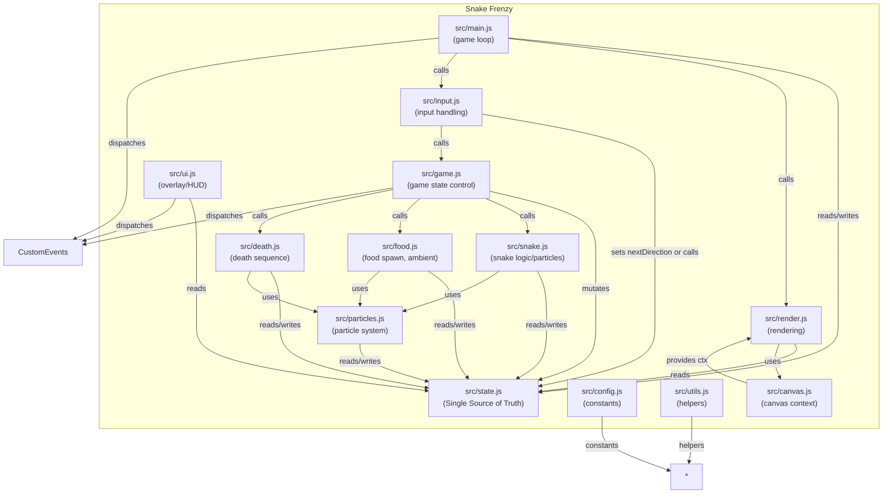

# Snake Game — Architecture Diagram

This document describes the high-level architecture of the Snake Frenzy project (vanilla JS + Canvas).
It includes a Mermaid diagram and explanatory notes describing module responsibilities, data flow, and interaction patterns.

## Mermaid Diagram

> Notes: the arrow labels are conceptual and indicate the primary interaction pattern. `*` indicates many modules import `utils` and `config`.

---

## Explanatory Notes

- Single Source of Truth (SSOT)
  - `src/state.js` holds all game state (snake array, food position, score, timers, particles).
  - Modules read from `state` to render or compute, and only specific modules should mutate it (game control, snake logic, death sequence).

- Module Responsibilities (SRP)
  - `src/config.js`: constants and tuning values (CELL_SIZE, colors, timings). No logic here.
  - `src/utils.js`: small helpers (randomInt, clamp, safe localStorage helpers). No side effects besides logging.
  - `src/canvas.js`: grabs the canvas and 2D context, handles DPR and focus wiring.
  - `src/render.js`: pure rendering functions that read `state` and draw to canvas. No state mutation.
  - `src/input.js`: normalizes keyboard/touch input into game commands (e.g., nextDirection). Should not run game logic.
  - `src/game.js`: orchestrates starting, pausing, resetting. Drives the high-level state transitions.
  - `src/snake.js`: step logic, collision detection, particle triggers for eating. Mutates `state.snake`.
  - `src/food.js`: spawn logic (safe, avoids snake) and ambient particles.
  - `src/death.js`: death animation/timers, awarding currency, saving high-score.
  - `src/particles.js`: central particle creation and cap enforcement (DRY & memory safety).
  - `src/ui.js`: DOM overlays and HUD, dispatches/receives events but should not mutate core gameplay state directly (reads allowed)

- Eventing & Decoupling
  - Use CustomEvents (`document.dispatchEvent(new CustomEvent(...))`) for cross-cutting notifications (game over, show/hide overlays, score updates) to avoid tight coupling.
  - The main loop in `src/main.js` performs: update (fixed tick for logic via lastTickAt) + render (every RAF frame).

- Performance Considerations
  - Rendering uses `requestAnimationFrame` and `dt`. Logic ticks are separated from frame rate.
  - Particle system is capped (`MAX_PARTICLES`) and culls off-screen particles.
  - Constants such as `CELL_SIZE`, `DPR`, and color values centralized in `config.js` for quick tuning.

---

## Text (ASCII) Diagram Fallback

If Mermaid isn't rendered, here's a compact ASCII view:

Main (main.js)
  ├─> State (state.js) [SSOT]
  ├─> Input (input.js) -> updates State/commands
  ├─> Game (game.js) -> orchestrates Snake/Food/Death
  ├─> Render (render.js) -> reads State -> Canvas (canvas.js)
  └─> UI (ui.js) <-> CustomEvents

Snake, Food, Death -> Particles -> State.particles
Config + Utils used across modules.

---

## How to use

- Open `ARCHITECTURE.md` in VS Code or GitHub to view the Mermaid diagram.
- Edit `src/config.js` to tune constants; the diagram and responsibilities above will help you decide where to change behavior.

---

If you want, I can also generate a PNG/SVG of the Mermaid diagram and add it to the repo for easy viewing in systems that don't render Mermaid. Would you like that? 
